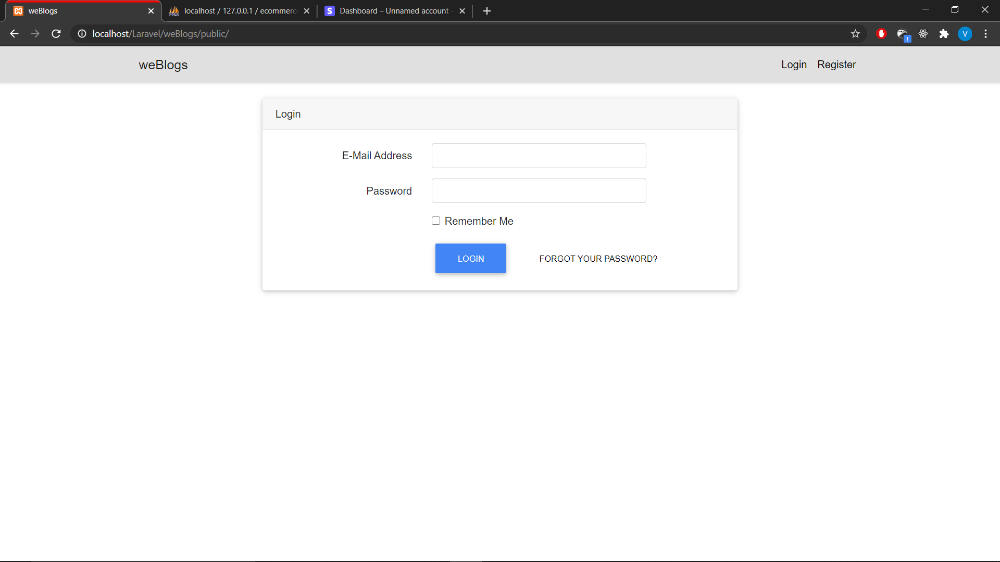
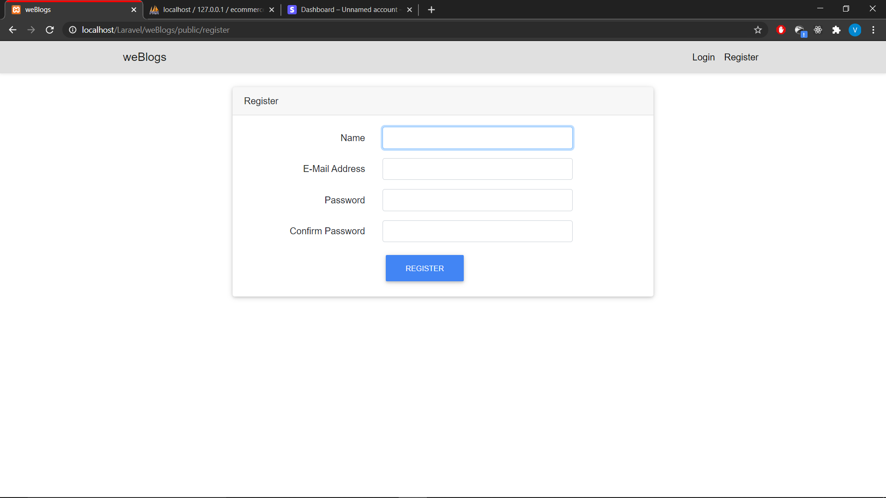
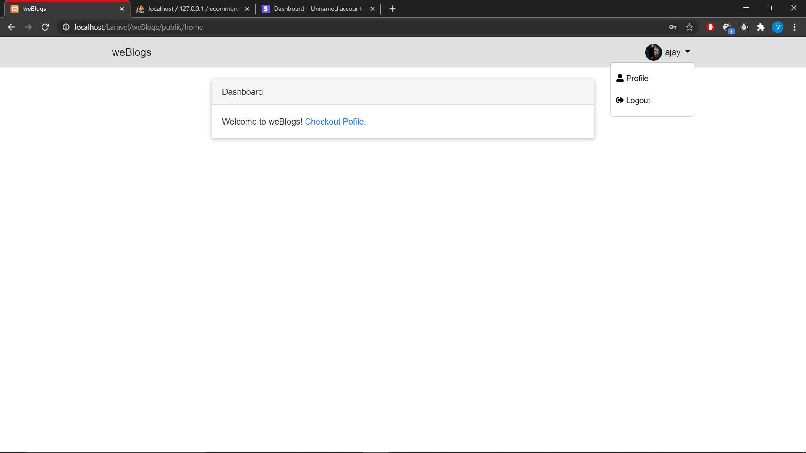
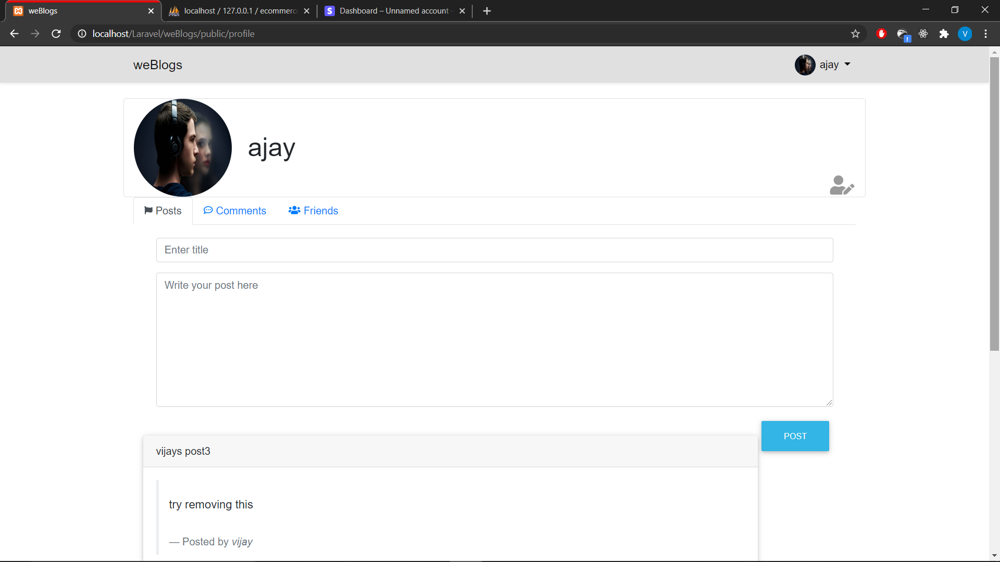
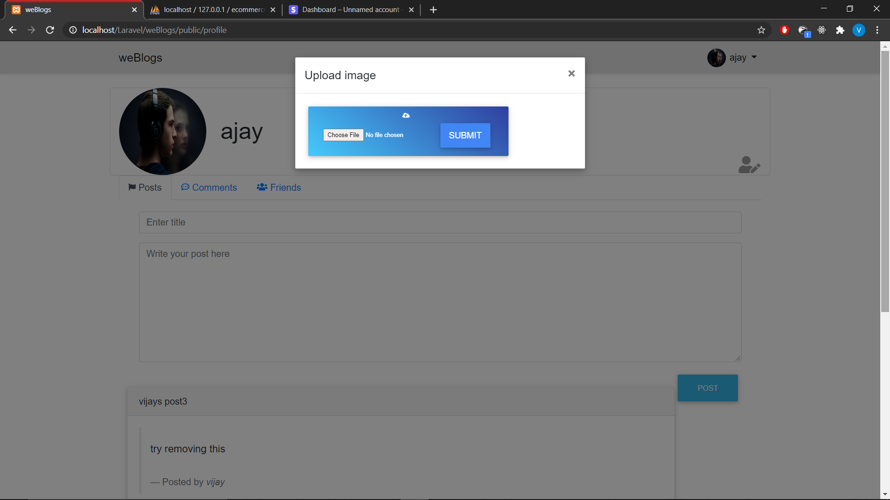
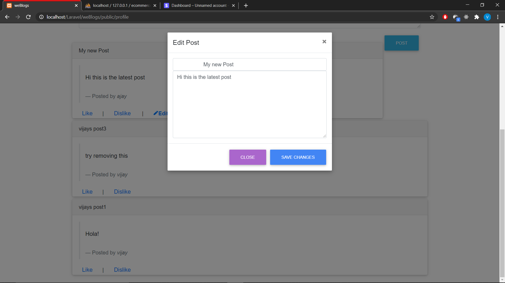
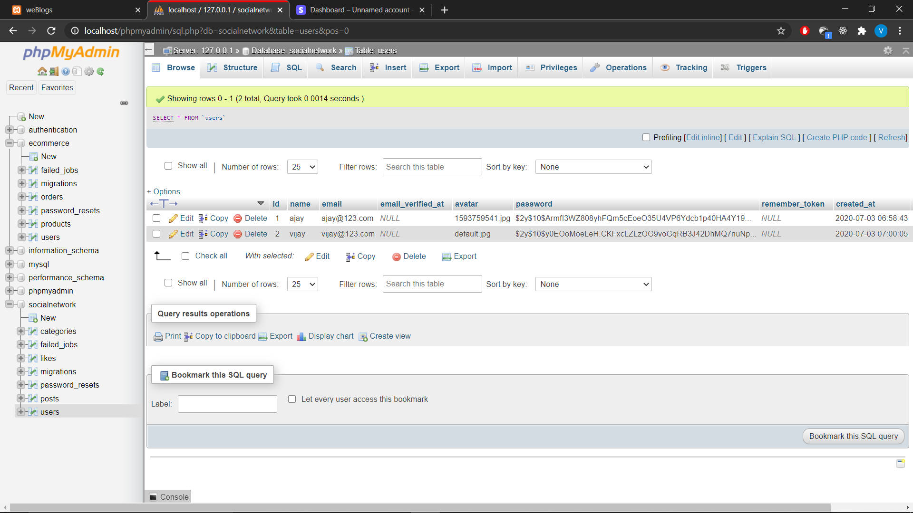
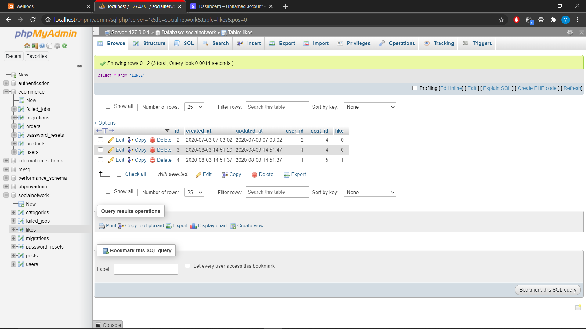

# weBlogs
   A social network app where users can upload their avatar, add posts, delete, edit and like or dislike others posts.

## Requirements
   * Xampp - php 7+
   * phpMyAdmin
   * Composer
   * Laravel 7.x

## Installation
   1. [Download & install xampp server](https://www.apachefriends.org/download.html)
   2. [Install composer in your local machine](https://getcomposer.org/download/)
   3. Now install Laravel globally using the cmd: `composer global require laravel/installer`
   4. After installation create a new project folder inside `C:\xampp\htdocs`and open command prompt in the same path.
   5. Type in the following command `laravel new project_name` for installing all the dependencies for your project.
   6. Check the app in your browser by typing `localhost/project_root/public/`

## Features
- User account
   - A simple registration form with four input fields.
   - A login form with redirection to registraion form.
   - Created users table in phpMyAdmin under database e-commerce

- Profile
   - User can change profile picture anytime with the help of `intervention image` package.
   - A post section is displayed to create post instantly.
   - Other users posts are also displayed in the profie.

- Posts
   - Latest posts appear at the top.
   - Registered users post can be updated.

- Update post
   - Like/Dilike is available common to both the uploader and the viewer.
   - Edit/Delete appears only for the uploader of the post.

- Future features
   - Uploading multimedia files with the post.
   - Friend request and notification.
   - live streaming features.
   - Search bar for finding users.

---

## Explore the app

### Force login

### Registration

### Dashboard

### Profile

### Profile picture

### New post

### Uploaded recent post

### Edit 

---

## Database

### Users

### Posts

### Like/Dislike

---

# Bugs
   - Post button click is not accurate.
   - Editing post modal fetches only the latest post.
   - Comments and friends menu is empty.

